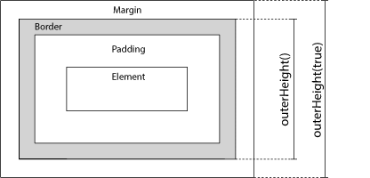

# 造轮子，学习~~

示例页面: [http://wencaizhang.com/zToolTip](http://wencaizhang.com/zToolTip)

## 代码约定

1. 在代码开头加上一个分号，避免代码与其他代码相连造成的错误
1. 插件代码使用自执行的匿名函数包裹，既能第一时间执行插件代码，又能防止全局变量污染
1. 将全局变量（如`window`）以参数形式传入插件内部，全局变量变为局部变量提升访问速度
1. 巧妙的 `undefined`，用 `undefined` 接受一个不存在的参数，自然就是真的 `undefined` 了，so hack~
1. 变量的定义，将要使用的变使用一个 `var`关键字一并定义在代码开头
    + 代码看起来整洁有规律，便于理解和管理
    + 变量之间使用逗号隔开的定义方式需要注意一个问题，即在增加新的变量时，要注意逗号和分号，避免出现下面的情况：
    ```js
    // bad
    var a = 1,
        b = 2,
        c = 3;
        d = 4;  // 新增变量

    // good
    var a = 1,
        b = 2,
        c = 3,
        d = 4;  // 新增变量
    ```
1. 以上仅为约定，并非必需

根据上面的约定，插件的外壳如下：

```js
;(function ($, window, document, undefined) {

    // some code ...

})(jQuery, window, document)
```

## 插件涉及到的 jQuery API

### 1. `offset()`

offset() 方法设置或返回被选元素**相对于文档**的偏移坐标。

当用于返回偏移时：该方法返回第一个匹配元素的偏移坐标。它返回一个带有两个属性（以像素为单位的 top 和 left 位置）的对象。

当用于设置偏移时：该方法设置所有匹配元素的偏移坐标。

### 2. `outerWidth()`

此方法返回第一个匹配元素的外部宽度，包含 padding 和 border，如需包含 margin，请使用 `outerWidth(true)`。


### 3. `outerHeight()`

此方法返回第一个匹配元素的外部宽度，包含 padding 和 border，如需包含 margin，请使用 `outerHeight(true)`。



## jQuery 插件开发

基本方法：

```js
$.fn.pluginName = function() {
    // some code ...
    return this;
}
```

基本上就是往 `$.fn` 上添加一个方法，方法名就是插件名，其中 `jQuery.fn = jQuery.prototype` ，而且在函数内部，`this` 指代 jQuery 选择的元素。

## 面相对象的插件开发

将变量定义为对象的属性，将函数定义为对象的方法，方便管理，而且不会影响外部命名空间。

## API

参数 | 说明 | 类型 | 默认值
---|---|---|---
`html` | 是否允许插入 html，如果您担心 XSS 攻击，请使用默认值 `false` | boolean | `false`
`trigger` | 触发行为，可选 `hover`/`focus`/`click` | string | `hover`
`placement` | 气泡框位置，可选 `top` `left` `right` `bottom` `topLeft` `topRight` `bottomLeft` `bottomRight` `leftTop` `leftBottom` `rightTop` `rightBottom` | string | `top`
